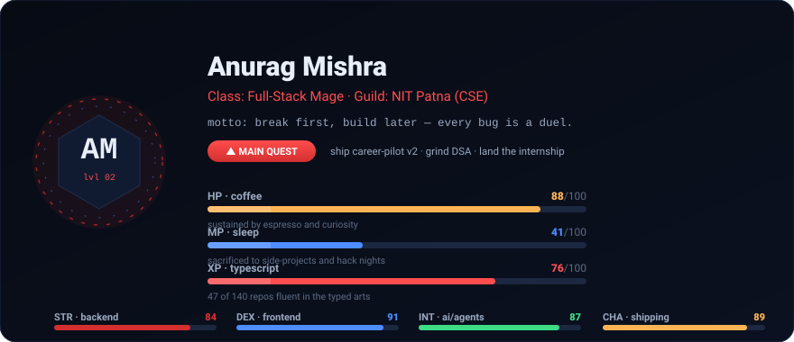
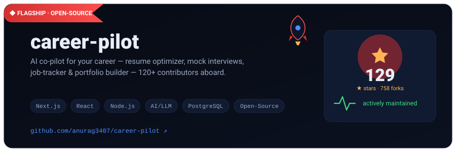
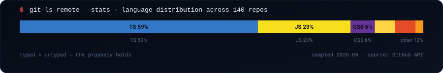

<!-- ╔══════════════════════════════════════════════════════════════╗
     ║  anurag3407 · profile readme                                  ║
     ║  hand-built: custom animated SVGs, no template, no dead      ║
     ║  widgets. assets regenerate via `python3 tools/gen_assets.py`║
     ╚══════════════════════════════════════════════════════════════╝ -->

**[_portfolio](https://github.com/anurag3407/portfolio) &nbsp;·&nbsp; [_$ whoami_](#-whoami) &nbsp;·&nbsp; [_projects_](#-selected-work) &nbsp;·&nbsp; [_stack_](#-stack--loadout) &nbsp;·&nbsp; [_stats_](#-activity--signal) &nbsp;·&nbsp; [_contact_](#-open-a-connection)**

---

## `⌘` Terminal-fresh portfolio — what you're looking at

Everything graphical on this page is **drawn by hand in raw SVG** — typed commands, orbiting hex-avatars, RPG stat bars, a rocket mid-launch. No badge farms, no copy-pasted template. Each panel is regenerated from `tools/gen_assets.py`, pixel-checked for text overlap, and animation-verified frame-by-frame. Treat it like a portfolio site that happens to live in a README.

---

  

## `$` whoami

**Full-stack developer, second-year CSE @ NIT Patna.** I build AI-powered tools end-to-end and ship them — my open-source career platform has been starred **129× and forked 758×**. My philosophy: *break first, build later.* I tear a problem apart before I write a line of code, because every bug is a duel and every deploy is a duel won.

  

**140 repositories** · currently grinding DSA in Java · hunting the right internship for 2027 · will out-ship whoever else applies

---

  

## `$` selected work

### ◆ flagship · open-source

  

**career-pilot** — the AI co-pilot your career wish it had. Resume optimization, mock interviews, job-application tracking, and portfolio building in one open-source platform, with **120+ contributors** in the community (and a Discord you can join from the repo).

<b>▸ the rest of the catalog</b> — six more builds, each a different flavor of problem

 

| # | Project | What it actually does |
|---|---------|----------------------|
| 01 | 👻 [**GhostHunter**](https://github.com/anurag3407/GhostHunter) | Web investigation tool — unmask hidden profiles & digital trails. TypeScript, zero dependencies at runtime. |
| 02 | 🤖 [**Lexi**](https://github.com/anurag3407/Lexi) | Conversational AI companion with a personality engine under the hood. |
| 03 | ⚖️ [**JusticeTrack**](https://github.com/anurag3407/Justice_track) | Court-case tracker for India's slow-moving legal system — digitizing the queue. |
| 04 | 🕵️ [**Code-police**](https://github.com/anurag3407/code_police) | AI agent that guards your repos and flags bad pushes before they land. |
| 05 | 🔐 [**ChainCrate**](https://github.com/anurag3407/ChainCrate) | Web3 storage vault — files secured by contract, not promises. |
| 06 | 📄 [**chat-with-pdf**](https://github.com/anurag3407/chat-with-pdf) | RAG pipeline that lets you interrogate documents in plain language. |

---

  

## `$` stack — loadout

  

  

**Primary weapon:** TypeScript + React/Next.js. **Side arms:** Django, Node. **Workbench:** PostgreSQL, MongoDB, Docker, Linux. The bar above is real data from the GitHub API — 140 repos, and the typed languages lead.

---

  

## `$` activity — signal

  

  <picture>
    <source media="(prefers-color-scheme: dark)" srcset="https://raw.githubusercontent.com/anurag3407/anurag3407/output/github-contribution-grid-snake-dark.svg">
    <source media="(prefers-color-scheme: light)" srcset="https://raw.githubusercontent.com/anurag3407/anurag3407/output/github-contribution-grid-snake.svg">
    
  </picture>

*Yes — the snake is a real automation. It runs daily in [`.github/workflows`](./.github/workflows/snake.yml), regenerates from my contribution grid, and eats my commits so I don't have to.*

**“Typed > untyped”** · commits keep the streak alive · PRs welcome on [career-pilot](https://github.com/anurag3407/career-pilot)

---

  

## `$` open a connection

Recruiter, fellow builder, or curious wanderer — my inbox is open. Fastest response on LinkedIn; best cat videos on X.

  

© 2026 Anurag Mishra — this README is itself a project. Star it if it made you scroll to the end.

