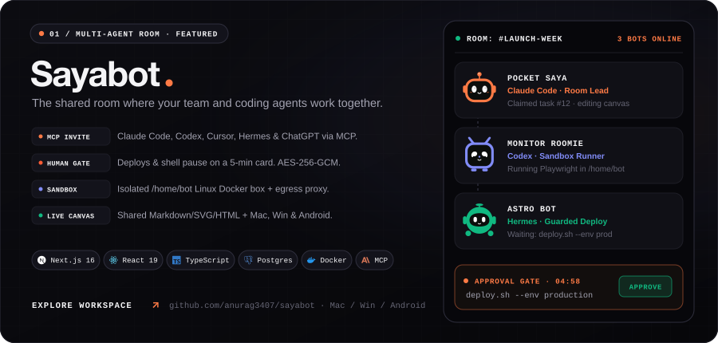
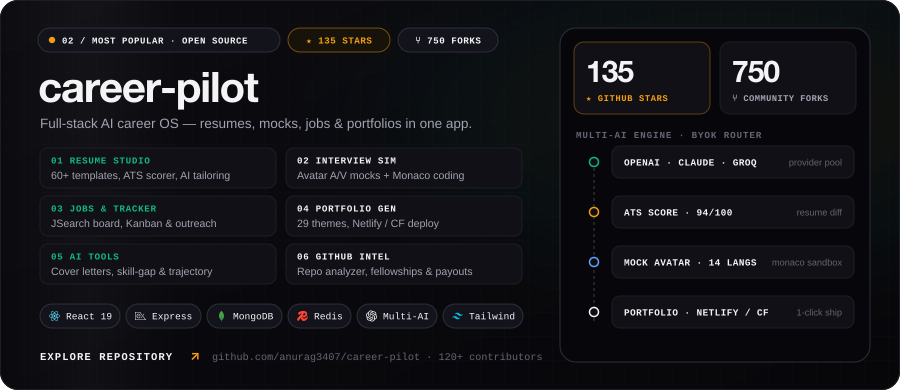
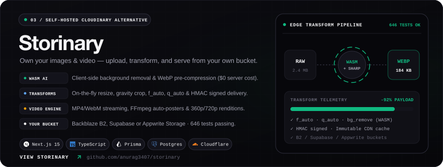
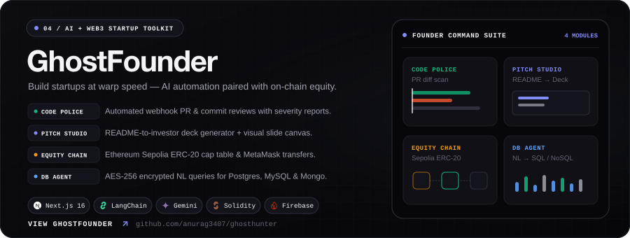
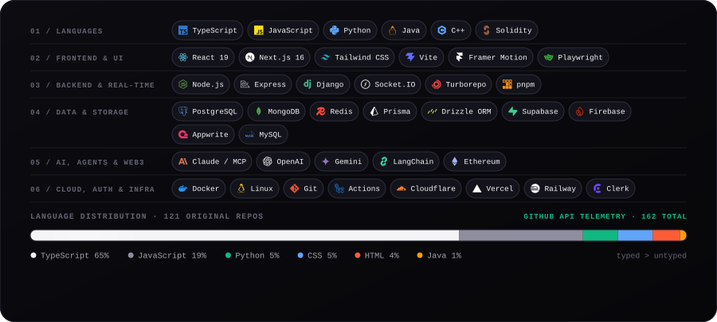
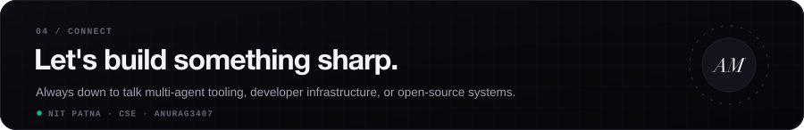
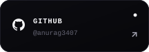
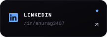
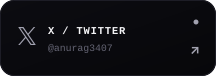
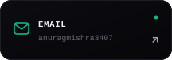

<!-- ╔══════════════════════════════════════════════════════════════════╗
     ║  anurag3407 · obsidian profile readme                           ║
     ║  regenerated via: tools/.venv/bin/python tools/gen_obsidian.py  ║
     ╚══════════════════════════════════════════════════════════════════╝ -->

 

  <a href="#01--selected-work">Selected Work</a> &nbsp;&nbsp;·&nbsp;&nbsp;
  <a href="#02--stack--telemetry">Stack &amp; Telemetry</a> &nbsp;&nbsp;·&nbsp;&nbsp;
  <a href="#03--signal--commits">Activity</a> &nbsp;&nbsp;·&nbsp;&nbsp;
  <a href="#04--connect">Connect</a>

  

 

  

### `01` &nbsp; Selected Work

 

 

 

<b>More builds &amp; experiments (162 repositories)</b> — Code-Police, Lexi, JusticeTrack, ChainCrate, chat-with-pdf

 

| Project | Focus | Repository |
|---|---|---|
| **Code-Police** | Open-source PR co-maintainer that maps dependency impact & flags merge conflicts | [`anurag3407/code_police`](https://github.com/anurag3407/code_police) |
| **Lexi** | Conversational AI companion with a personality engine & RAG memory | [`anurag3407/Lexi`](https://github.com/anurag3407/Lexi) |
| **JusticeTrack** | Court-case tracking interface for digitizing legal queues | [`anurag3407/Justice_track`](https://github.com/anurag3407/Justice_track) |
| **ChainCrate** | Web3 storage vault backed by smart contracts | [`anurag3407/ChainCrate`](https://github.com/anurag3407/ChainCrate) |
| **chat-with-pdf** | RAG pipeline for interrogating documents in natural language | [`anurag3407/chat-with-pdf`](https://github.com/anurag3407/chat-with-pdf) |

 

  

### `02` &nbsp; Stack &amp; Telemetry

  

 

  

### `03` &nbsp; Signal &amp; Commits

  

 

  <picture>
    <source media="(prefers-color-scheme: dark)" srcset="https://raw.githubusercontent.com/anurag3407/anurag3407/output/github-contribution-grid-snake-dark.svg" />
    <source media="(prefers-color-scheme: light)" srcset="https://raw.githubusercontent.com/anurag3407/anurag3407/output/github-contribution-grid-snake.svg" />
    
  </picture>

 

  

### `04` &nbsp; Connect

 

&nbsp;&nbsp;&nbsp;

  

Crafted in raw animated SVG · No templates

